# Screenshots

Real screenshots from a Sovol SV08 (CoreXY) running FilaMind Flow, with live data
from the printer and its host. Shown in the default light theme and English; the UI
also ships in 7 languages and 7 themes.

## Dashboard

The home view: live printer and host state, a short getting-started checklist, and
quick cards into each tool.

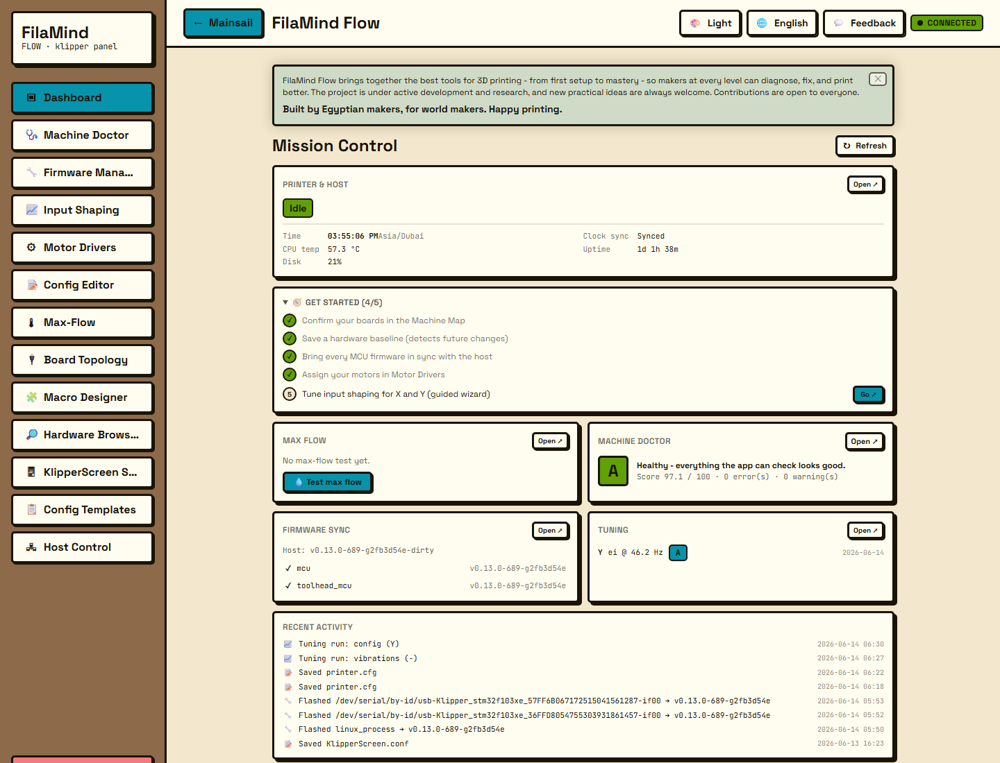

## Machine Doctor

One read-only scan across the whole printer, graded A-F, with every finding linking
to the widget that fixes it.

[Read more](../widgets/machine-doctor.md)

## Firmware Manager

MCU firmware versions, host sync status, toolchain readiness, and a gated build/flash
for every board.

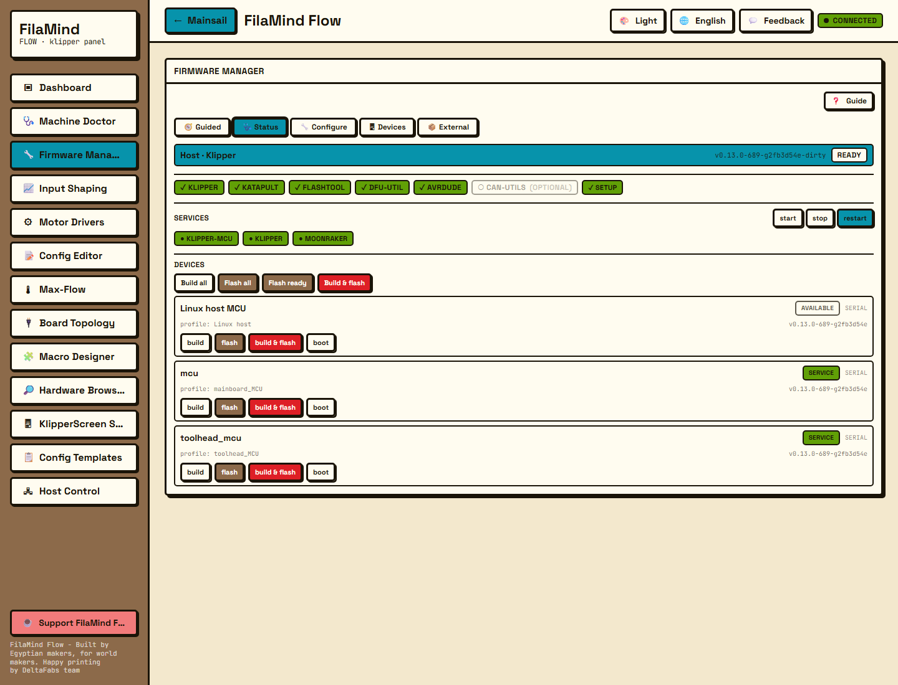

[Read more](../widgets/firmware-manager.md)

## Motor Drivers

Live TMC stepper-driver inventory with datasheet-based current tuning, homing, and a
guarded register editor.

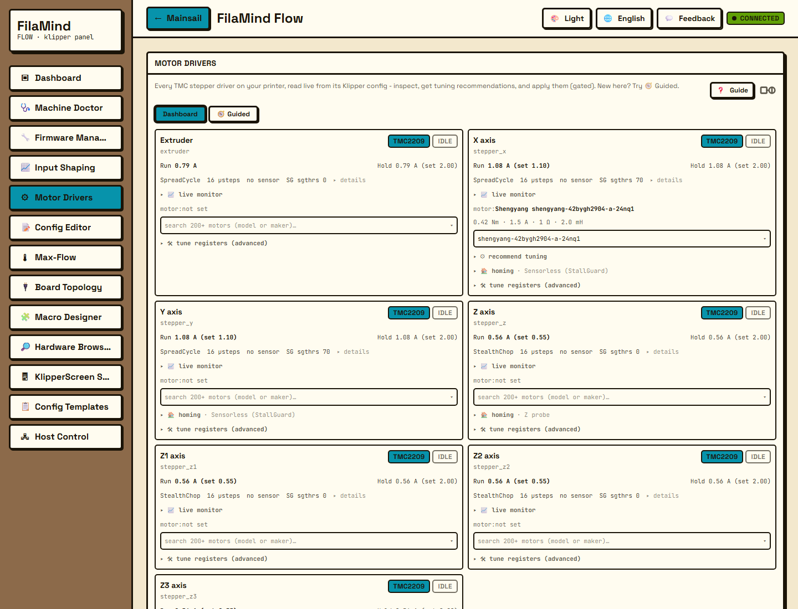

[Read more](../widgets/motor-drivers.md)

## Hardware Browser

A curated, deduped catalog of thousands of parts, with the parts detected on this
printer surfaced at the top.

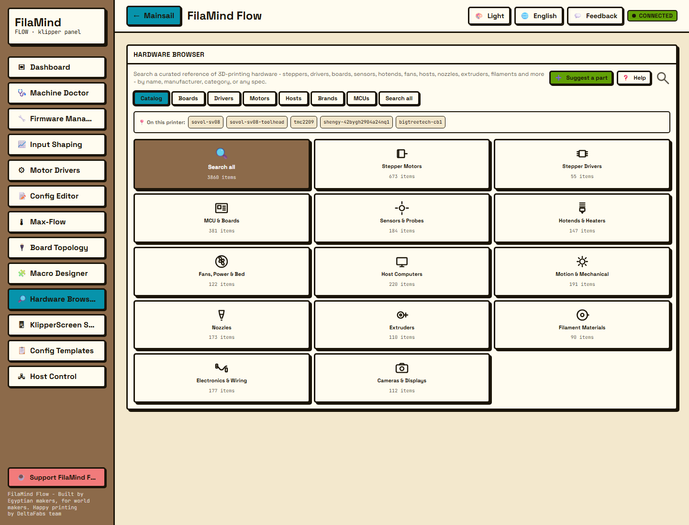

[Read more](../widgets/hardware-browser.md)

## Config Editor

The live Klipper config read from Moonraker, parsed into sections and parameters, with
structural problems flagged.

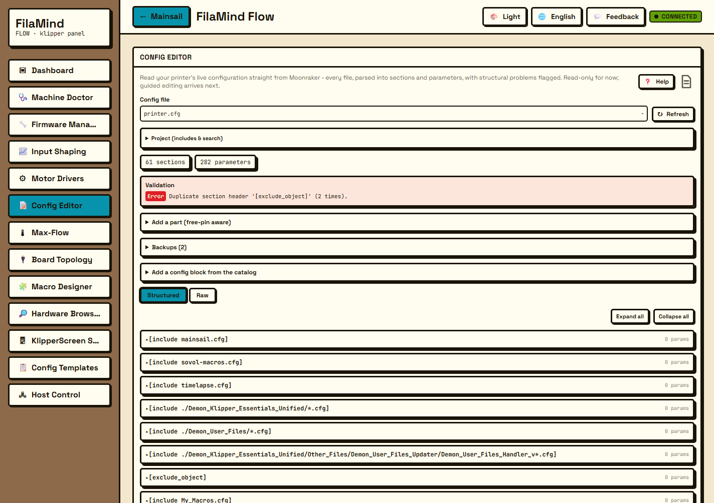

[Read more](../widgets/config-editor.md)

## Board Topology

An interactive map of the printer's control boards and the MCUs they talk to, linked to
the hardware catalog.

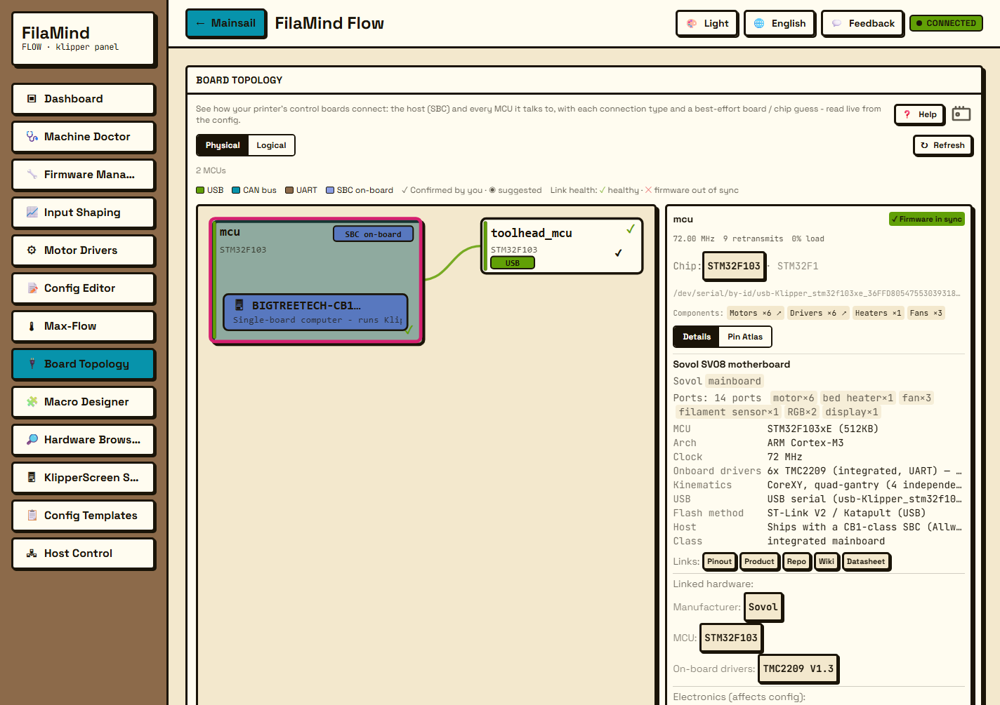

[Read more](../widgets/board-topology.md)

## Max-Flow

Ramp extrusion flow to find the highest volumetric speed the hotend can sustain, watched
by the extruder's StallGuard load.

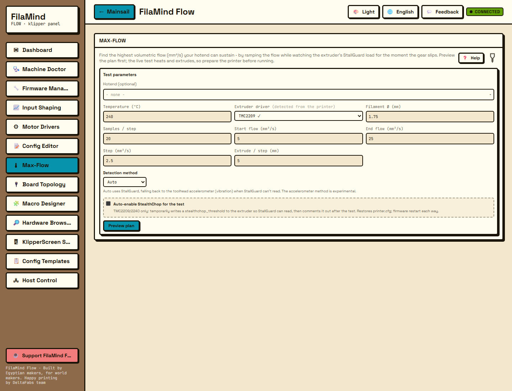

[Read more](../widgets/max-flow.md)

## Input Shaping

Turn a resonance capture into a ready `[input_shaper]` config, with a guided walk-through
from noise to shaper.

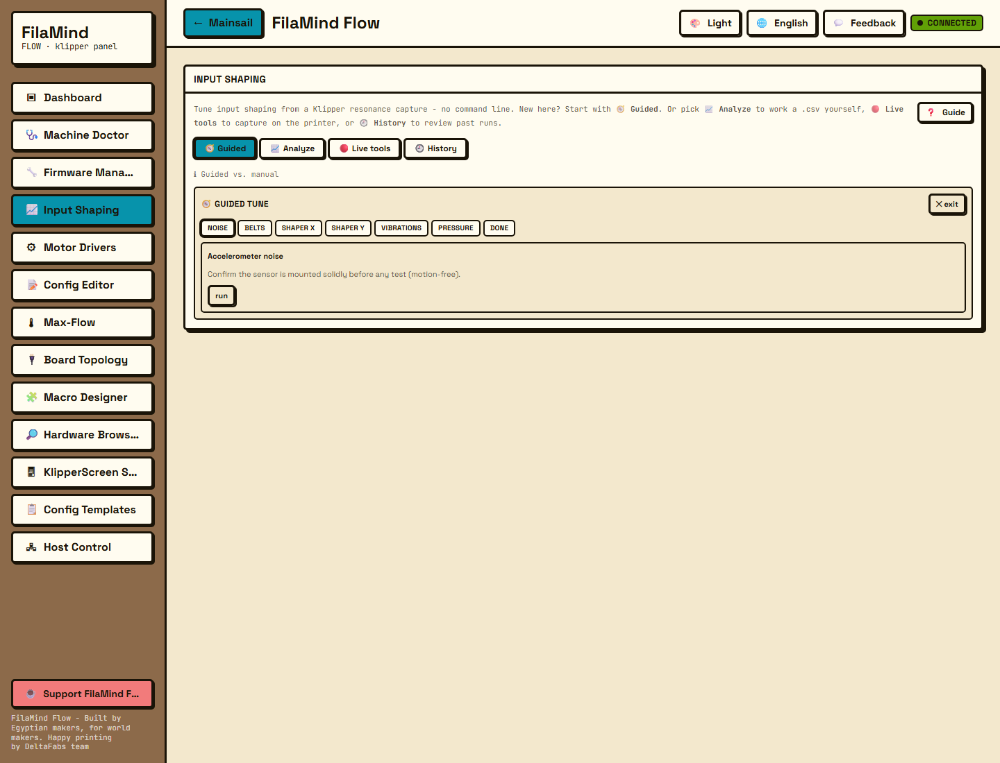

[Read more](../widgets/input-shaping.md)

## Macro Designer

An offline G-code simulator: paste or load a macro and see its toolhead path, totals, and
a time estimate without touching the printer.

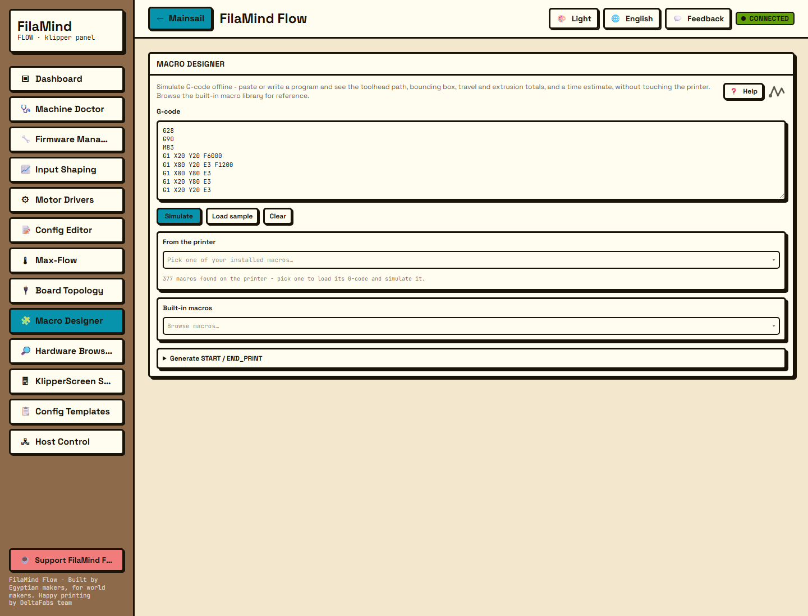

[Read more](../widgets/macro-designer.md)

## Config Templates

Paste-ready Klipper config blocks and macros, filterable by category, with one-click copy.

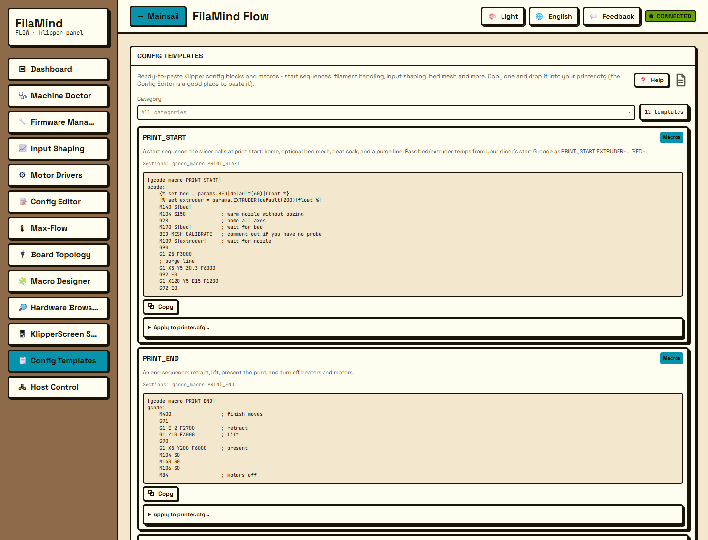

[Read more](../widgets/config-templates.md)

## KlipperScreen Studio

Manage the printer's touchscreen: edit its config safely, build themes and menus, or run
Kiosk mode.

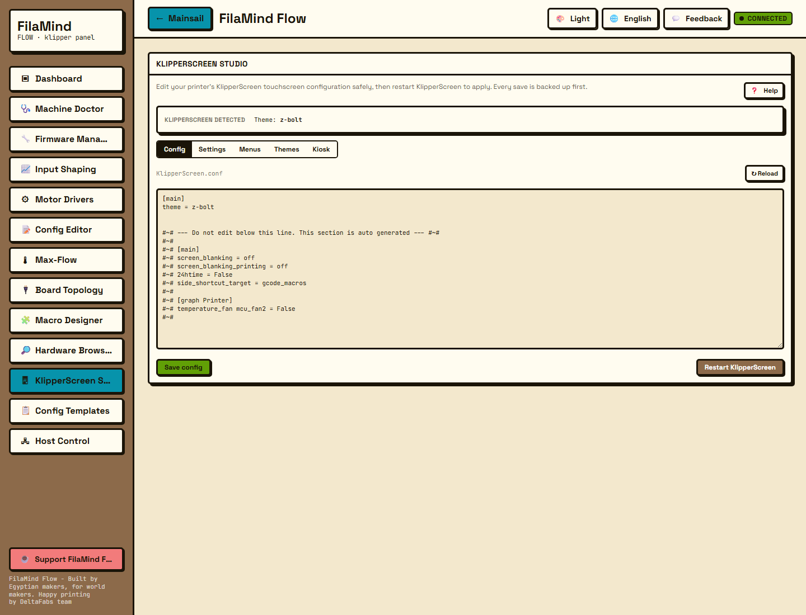

[Read more](../widgets/klipperscreen-studio.md)

## Host Control

Monitor the printer's Linux host (CPU, memory, disk, uptime), manage its services, free
space, and change system settings.

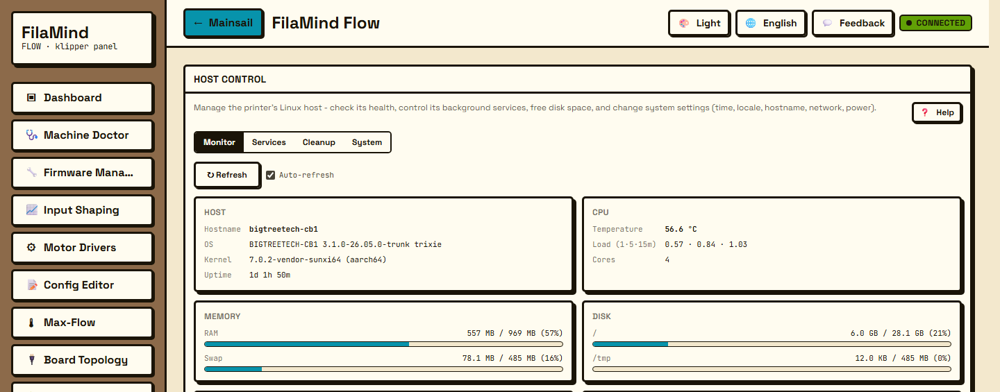

---

Back to the [main README](../../README.md) or the [widget docs](../widgets/).
