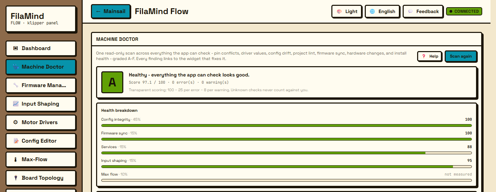

# Machine Doctor

Machine Doctor runs a single read-only scan across everything FilaMind can check and hands you back a graded report. It's the widget to open when something feels off, or when you just want a health check before a long print.

## What it does

The scan looks at your machine from several angles in one pass. It checks for pin conflicts in your config, compares driver values against the real ceilings for your hardware, and looks for config drift between what's on disk and what's actually running. It also lints your project for the kinds of mistakes that bite you later.

Beyond the config itself, it confirms firmware is in sync, flags hardware changes since the last time it looked, and checks that the install is healthy.

Every check feeds into one overall grade from A to F. The scoring is transparent, so you can see why a finding lowered the grade rather than just being handed a number. The score itself is a weighted blend of the health pillars the Doctor could actually measure (config integrity, firmware sync, services) — signals it can't read right now, like a firmware version while Moonraker is down, simply don't count against you.

Setup steps are handled separately from health. Running input shaping and finding your max flow are tuning tasks, not faults, so leaving them undone never lowers the score — but until they're done the Doctor holds the letter grade at B and tells you what's left, alongside a small "Setup completeness" tally. An unresolved warning also holds the grade at B and a real error holds it at C, so a clean "healthy" A only ever appears when nothing is broken and setup is finished. That way a strong score and a held-back grade never look like a contradiction: the widget always says why.

Each finding is actionable too. When the Doctor spots a problem, it deep-links straight into the widget that fixes it, so you don't have to go hunting for the right screen.

## Using it

The typical flow is short. Open Machine Doctor and start a scan. It reads across pins, drivers, config, project lint, firmware, hardware, and install health, then shows the A-F grade with the findings that produced it. Work through the findings by following each one's link into the widget that addresses it. When you're done, scan again to confirm the grade has moved.

## Notes

The scan is read-only. It looks and reports; it does not change your configuration on its own. Anything that would write follows the usual confirm gate in the widget you're sent to, and actions are refused while a print is running.

Some parts of the scan are experimental, so treat those findings as guidance rather than gospel. The Doctor works on any Klipper printer.

← [All widgets](./README.md) · [FilaMind Flow](../../README.md)
